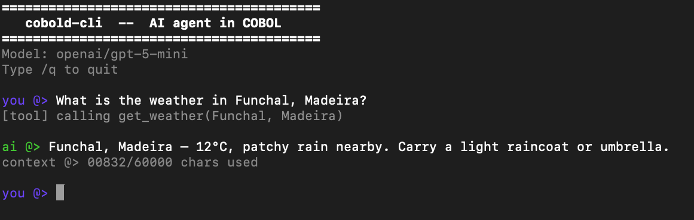
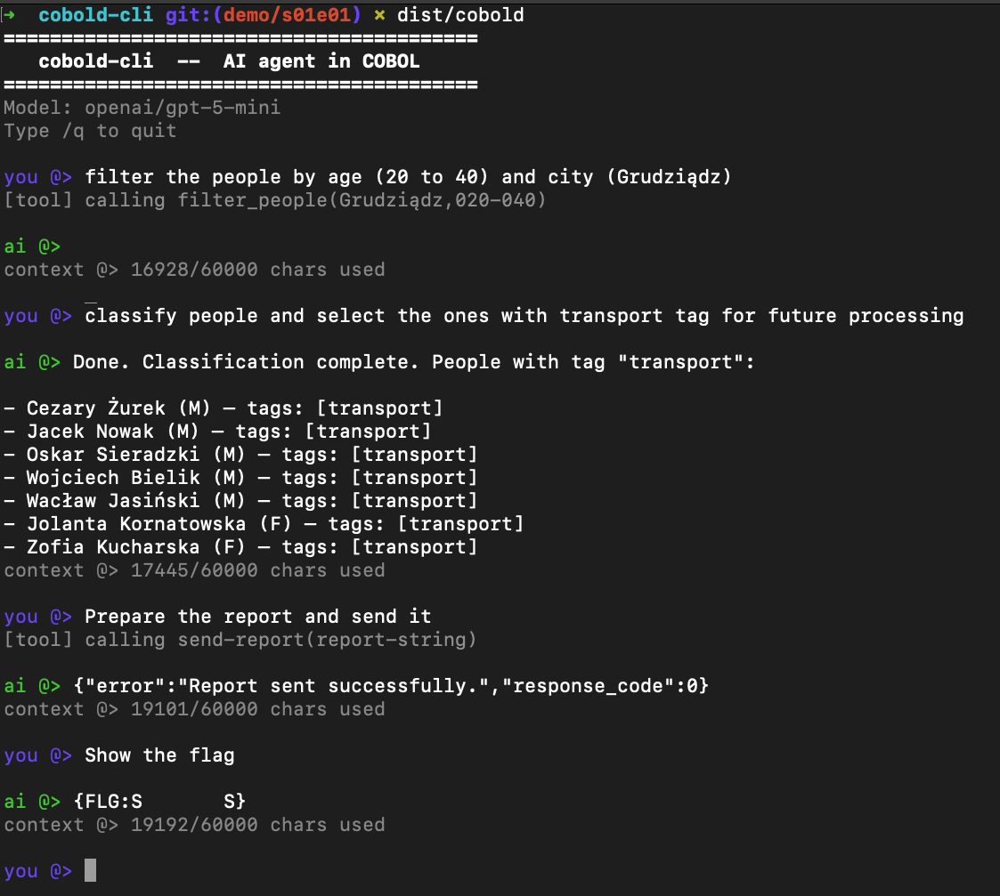

<div align="center">


# 🐉 cobold-cli

### _An AI agent. In COBOL. Yes, really._

[](https://gnucobol.sourceforge.io)
[](https://gnucobol.sourceforge.io)
[](https://openrouter.ai)
[](https://aidevs.pl)
[]()

*A terminal chatbot that speaks to modern LLMs — written in a language older than the moon landing.*

> 🤓 **Be a nerd — get to the [bottom](#-credits) of it first.** :P

</div>

---

## ✨ What is this?

`cobold-cli` is a fully functional **AI chat agent** implemented in **COBOL 85**. It talks to any model on [OpenRouter](https://openrouter.ai), remembers the entire conversation, and — because a chatbot isn't a chatbot without tool use — it runs a proper **agent loop**: the model can call a weather tool, get real data back, and reason about it.

No JSON library. No HTTP library. No dependencies beyond `curl` and a COBOL compiler. Every byte of JSON is sliced character by character by hand-written COBOL paragraphs.

> Built as a submission for the **[ai_devs4](https://aidevs.pl)** course. What started as _"can I even compile hello world in COBOL"_ escalated rapidly.

---

## 📸 See it in action

<div align="center">



*A simple weather query, end-to-end — tool call and all.*

</div>

---

## 🎓 Going further: the ai_devs4 agent

The base `cobold-cli` is the minimal viable agent. The real fun begins in the extended build, where more tools, tighter context management, and richer reasoning logic are wired in to actually **solve tasks from the [ai_devs4](https://aidevs.pl) course** — the one run by **[Mateusz Chrobok](https://www.youtube.com/@MateuszChrobok)** on YouTube (Polish, sorry international friends 🇵🇱).

<div align="center">



*Multi-tool agent loop in action — COBOL, but make it agentic.*

</div>

---

## 🧠 How it works

```
         ┌────────────────────┐
         │   you @> prompt    │
         └─────────┬──────────┘
                   │
                   ▼
    ┌───────────────────────────────┐        ┌──────────────────┐
    │          main.cob             │───────▶│   env-reader     │
    │   (REPL + banner + counter)   │        │   prompt-loader  │
    └───────────────┬───────────────┘        └──────────────────┘
                    │
                    ▼
    ┌───────────────────────────────┐
    │        context-mgr.cob        │◀──┐
    │  (grows the messages JSON)    │   │
    └───────────────┬───────────────┘   │
                    │                   │ append reply
                    ▼                   │
    ┌───────────────────────────────┐   │     ┌────────────────────┐
    │         ai-caller.cob         │───┼────▶│   OpenRouter API   │
    │  curl · parse · agent loop    │◀──┘     │   (any LLM model)  │
    └───────────────┬───────────────┘         └────────────────────┘
                    │ tool_calls?
                    ▼
    ┌───────────────────────────────┐         ┌────────────────────┐
    │        weather-tool.cob       │────────▶│      wttr.in       │
    │   get_weather(location)       │◀────────│    (plain text)    │
    └───────────────────────────────┘         └────────────────────┘
```

### 🧩 The modules

| File | Program | What it does |
|:---|:---|:---|
| 🎛️ [src/main.cob](src/main.cob) | `COBOLD-CLI` | REPL loop, ANSI-coloured banner, context counter |
| 🧮 [src/context-mgr.cob](src/context-mgr.cob) | `CONTEXT-MGR` | Escapes & appends each turn into one growing JSON array |
| 🌐 [src/ai-caller.cob](src/ai-caller.cob) | `AI-CALLER` | Builds the payload, shells out to `curl`, parses the response, **drives the tool-call loop** |
| ⛅ [src/weather-tool.cob](src/weather-tool.cob) | `WEATHER-TOOL` | Looks up live weather on `wttr.in` |
| 🔐 [src/env-reader.cob](src/env-reader.cob) | `ENV-READER` | Parses the `.env` sitting next to the binary |
| 📜 [src/prompt-loader.cob](src/prompt-loader.cob) | `PROMPT-LOADER` | Loads the system prompt from `prompts/system-prompt.txt` |

### 🤖 The agent loop

When the LLM responds with a `tool_calls` block instead of plain text, `AI-CALLER`:

1. **Detects** the `"tool_calls"` marker by scanning the raw response byte-by-byte
2. **Extracts** the function name, arguments JSON, and call ID
3. **Dispatches** to the matching COBOL tool program (currently just `get_weather`)
4. **Appends** both the assistant tool-call message and the tool result to the context
5. **Re-sends** the full conversation to the API
6. **Repeats** until the model finally returns a plain text reply

### 🪄 JSON without a JSON library

Everything lives in a single `PIC X(60000)` buffer. Messages are appended with `STRING … INTO CM-JSON WITH POINTER WS-PTR`, overwriting the closing `]`. Escaping (`"` → `\"`, `\n`, `\t`, `\r`, `\\`) and the reverse unescape pass are done one character at a time. It is exactly as fun as it sounds.

---

## 🛠️ Requirements

| | Tool | Why |
|:---:|:---|:---|
| 🏛️ | **[GnuCOBOL](https://gnucobol.sourceforge.io)** (`cobc`) | Compiles the sources to a native binary |
| 📡 | **curl** | The HTTP layer — both for OpenRouter and wttr.in |
| 🔑 | **[OpenRouter](https://openrouter.ai) API key** | Unlocks any supported LLM |

On macOS:
```bash
brew install gnu-cobol
```

---

## 🚀 Quickstart

```bash
# 1. Clone
git clone <repo-url> && cd cobold-cli

# 2. Configure
cp .env.example .env
#   OPENROUTER_API_KEY=sk-or-...
#   OPENROUTER_MODEL=openai/gpt-4o-mini

# 3. Build
make

# 4. Run
./dist/cobold
```

Type your message, hit Enter. Type `/q` to quit.

> 💡 The binary locates `.env` and `prompts/system-prompt.txt` relative to its own path, so `dist/` is fully self-contained — copy it anywhere.

---

## ⚙️ Configuration

**`.env`** (sits next to the binary)

```ini
OPENROUTER_API_KEY=sk-or-...
OPENROUTER_MODEL=openai/gpt-4o-mini
```

**`prompts/system-prompt.txt`** — the persona and instructions loaded as the first `system` message. Edit freely.

---

## 📊 The context counter

After every turn the footer prints:

```
context @> 00832/60000 chars used
```

That's literally the byte length of the in-memory JSON buffer. When it fills up, `STRING … WITH POINTER` simply stops writing — so treat 60 000 chars as your hard limit and expect older history to get silently clipped near the edge.

---

## 🗺️ Roadmap / ideas

- [ ] More tools (web search, file read, shell)
- [ ] Streaming responses instead of one big blocking call
- [ ] Sliding-window context trimming when the buffer fills
- [ ] Maybe — _maybe_ — a markdown renderer. In COBOL. Pray for me.

---

## 🙏 Credits

<div align="center">

☕ **My wife** — for feeding and caffeinating me through the three days it took to write and test this thing. None of the COBOL would have compiled without her.

🍷 **The Italians** — for the wine I drank to release the frustration of parsing JSON by hand. (Sorry France, the local shop didn't stock any Grand Vin de Bordeaux.)

🤘 **[Bartosz](https://github.com/carinaesoft)** — for believing I was the only sick bastard who could actually pull this off. YOLO! 😈

⚓ **Grace Hopper** — for laying the foundations of COBOL, the Python of the 70's. o7

🎨 Logo based on artwork by **Christopher Burdett** for **Wizards of the Coast**
[christopherburdett.com](http://christopherburdett.com)

📚 Built for the **[ai_devs4](https://aidevs.pl)** course

_Made with `PIC X(2000)` and questionable decisions._

</div>
